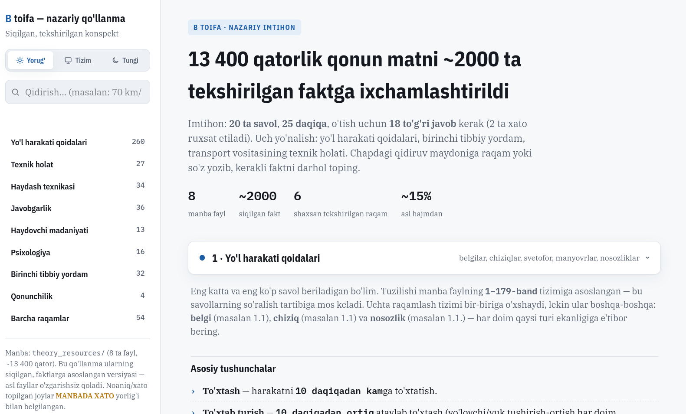

# Haydovchilik guvohnomasi (B toifa) — nazariy tayyorgarlik materiallari

> Jonli [shu yerda](https://driverslicence.notion.site)

Ushbu repozitoriy O'zbekiston Respublikasida "B" toifa haydovchilik guvohnomasini olish uchun
nazariy kursning o'quv materiallarini o'z ichiga oladi. Har bir fayl kursning bitta yo'nalishiga
mos keladi va o'z navbatida bir nechta mavzuga bo'lingan (fayl ichida `Mavzu:` sarlavhasi va
`---` ajratkichi bilan belgilangan).

## Fayllar tuzilishi

| Fayl | Yo'nalish | Qamrab olgan mavzular |
|---|---|---|
| `theory_resources/qa.md` | Yo'l harakati sohasidagi qonunchilik | Yo'l harakati xavfsizligi, Transport, Sug'urta faoliyati to'g'risidagi qonunlar; normativ-huquqiy hujjatlar |
| `theory_resources/yhq.md` | **Yo'l harakati qoidalari** (asosiy hujjat) | Umumiy qoidalar, ishtirokchilarning majburiyatlari, yo'l belgilari (7 toifa), yo'l chiziqlari, svetofor va ishoralar, manyovr, joylashuv, tezlik/quvib o'tish, to'xtash, chorrahalar, piyodalar o'tish joyi, magistral, yoritish, shatak, yuk/yo'lovchi tashish, texnik holat, velosiped/moped, ro'yxatdan o'tkazish majburiyatlari |
| `theory_resources/hhj.md` | Yuridik javobgarlik | Ma'muriy javobgarlik (MJtK), jinoiy javobgarlik va tabiatni muhofaza qilish, fuqarolik javobgarligi va OSAGO sug'urtasi |
| `theory_resources/hm.md` | Haydovchining madaniyati | Ahloqiy va huquqiy madaniyat, kasbga qo'yiladigan talablar, kasbiy mahorat, YTH oldini olish, so'zlashuv madaniyati |
| `theory_resources/hfpa.md` | Haydovchi psixologiyasi | Psixik jarayonlar, hissiy-irodaviy jarayonlar, individual psixologik xususiyatlar, muloqot psixologiyasi |
| `theory_resources/yhbyk.md` | Birinchi tibbiy yordam | Jarohatlanish tasnifi, qon oqishini to'xtatish, bosh/umurtqa va tayanch-harakat a'zolari shikastlanishi, termik shikastlanishlar |
| `theory_resources/battxk.md` | Transport vositasining tuzilishi | Avtomobil tuzilishi, elektromobillar, gaz ballonli avtomobillar, texnik xizmat ko'rsatish, nosozliklarni bartaraf qilish |
| `theory_resources/axbhxa.md` | Boshqarish texnikasi | Safarni rejalashtirish, kuzatish va xavfni baholash, boshqarish texnikasi, foydalanish ko'rsatkichlari, xavfsizlik tizimlari, chorraha/to'xtash joylarida boshqarish, transport oqimida va qorong'ida boshqarish, murakkab vaziyatlar |

## Manba va tekshiruv holati

Ushbu materiallar 2026-yil avgust holatiga O'zbekiston Respublikasining amaldagi qonunchiligi
(lex.uz) va rasmiy Yo'l harakati qoidalari (VM 172-son, 2022-yil 12-aprel) asosida tekshirilgan.
Tekshiruv davomida aniqlangan kamchiliklar va ularni bartaraf etish ishlari commit tarixida
qayd etilgan.

## Qisqartirilgan qo'llanma (`study_notes/`)

`study_notes/index.html` — yuqoridagi 8 ta faylning imtihon uchun siqilgan, dizayn qilingan
HTML versiyasi (~13 400 qatordan ~2000 ta faktga). Asl fayllar o'zgarishsiz qoladi — bu shunchaki
tezkor takrorlash vositasi. Bir nechta raqam (favqulodda telefon, rul erkin yurishi, ogohlantiruvchi
uchburchak masofasi va h.k.) asl fayllardagi xato/ziddiyatlarni tuzatib, mustaqil tekshirilgan holda
keltirilgan — batafsili `CLAUDE.md`da.
